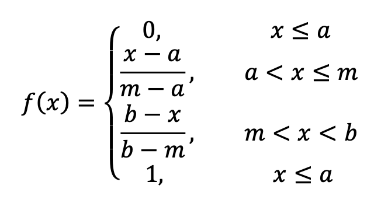
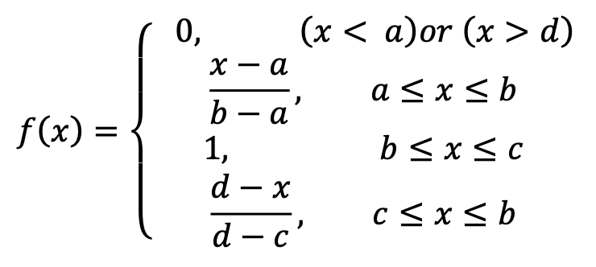
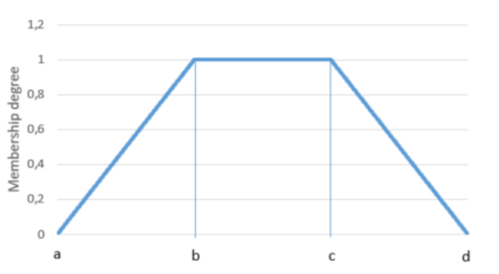
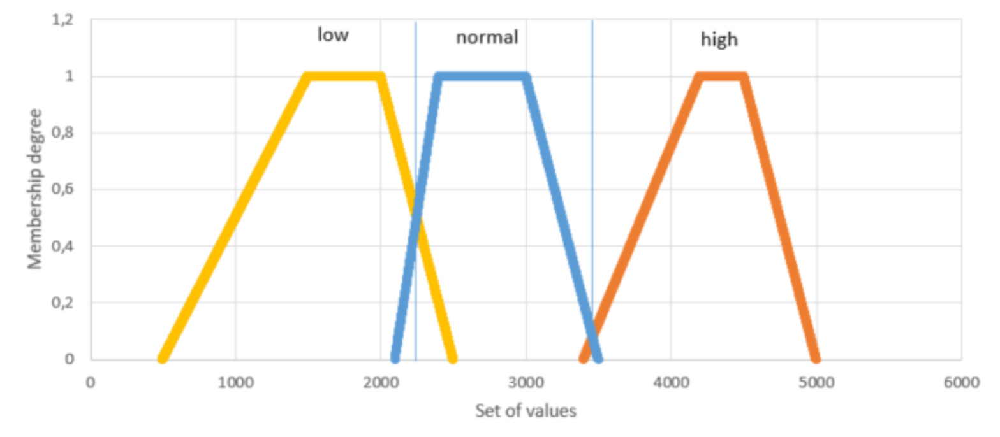
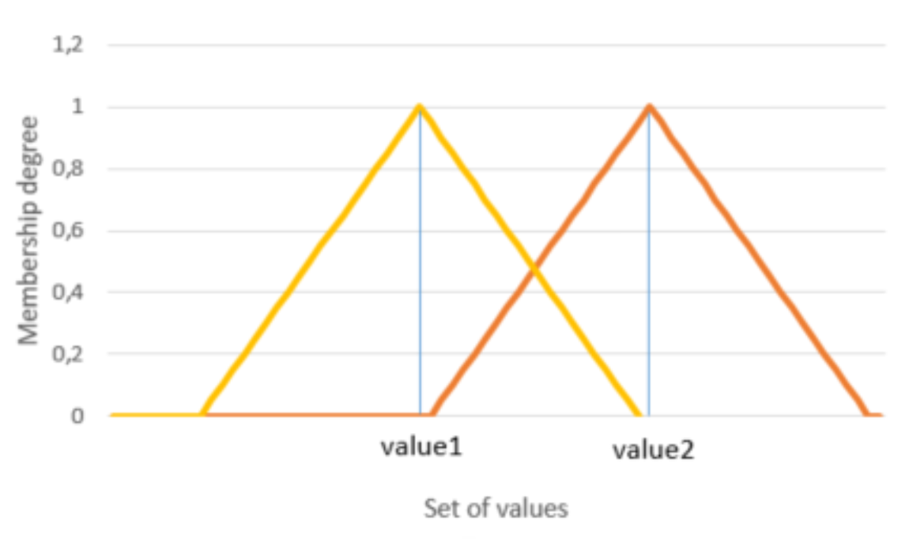

## Introduction
Core implementation of the solution is based on a few simple mathematical functions. 
* triangular,
* trapezoidal
* gaussian

## Triangular function
Triangular function is simply a set of linear functions which allows to represent a triangular on the origin.
 

## Trapezoidal function
Trapezoidal function is simply a set of linear functions which allows to represent a trapezoid on the origin.
 

 

## Gaussian function
Gaussian function is simply a set of linear functions which allows to represent a gaussian on the origin.

## Concept of linguistic approach
Linguistic approach allows to combine a set of trapezoidal functions inside 1 origin. Then each of those function is being 
assigned to the specific linguistic value. Based on the calculated membership degree, for the value which is taken from the stream of data, the linguistic value is assigned. Hence, arbitrary values taken from the realtime environment can be clustered and assigned to specific groupes. 
 

## Concept of triangular intersection - common point and it membership degree
This method represents 2 triangles intersecting (or not) on the origin. Both triangles have equally long arms and values that are passed to the specific function are the ones which represent the triangles' middle points. For each triangle, there is given a second value which represents the distance between the middle point and the intersection of origin with appropriate arm of the triangle. The following image shows what such implementations exactly means.
 

